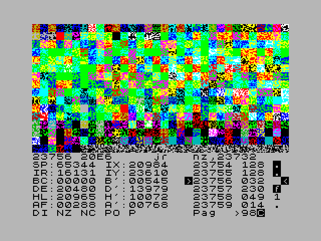

# Devastace MB03+ 1.0

The first numbered release of our MB03+ modification of the earlier working version of Devastace.



## Usage

The ready-to-load program is [runable/MB-Dev10.TAP](runable/MB-Dev10.TAP). The raw binary, [source/MBDEVY9.3](source/MBDEVY9.3), is 7,168 bytes long and loads at `#4000` (`#4000–#5BFF`). It does not require the ZX ROM. `Y9` is the development filename; the official release is **1.0**.

- Press **Y** to choose the SRAM page mapped into the bottom 16 KB (`#0000–#3FFF`). The current value is shown at the right end of the bottom row.
- Enter the value in Devastace's selected number base: decimal `0–255` or hexadecimal `00–FF`. The complete eight-bit control value is written to port `#17` (decimal 23).
- **ENTER** confirms, **DELETE** removes the last digit, and **EDIT** cancels. An empty entry or a value above 255 leaves the page unchanged.
- The original Y command for reading a tape header is replaced by page selection.
- On exit with **SS+Q**, Devastace automatically selects page 64 (`#40`, ZX ROM) to avoid a system crash.

## Optional relocation of the helper block

By default, the 256-byte helper block occupies `#5B00–#5BFF`. Set a different destination in a **fresh copy of the binary that has not yet been run**. The file offsets are `#0C26–#0C27`, low byte first: the default bytes `00 5B` select `#5B00`, while `00 80` selects `#8000`. When the binary is loaded at `#4000`, the corresponding memory addresses are `#4C26–#4C27`.

To create a separately configured copy, run the following commands from the repository root:

```text
cd source
python configure_devastace_relocation.py --dest 0x8000
```

The target must be free, writable RAM that remains accessible with every page you intend to use. On its first start, Devastace copies the block and adjusts its references. Starting the **same already-run image** again does not relocate it again.

**To inspect the original contents of `#5B00`:** save those 256 bytes elsewhere *before* loading Devastace, copy the **entire** 7,168-byte binary to `#4000–#5BFF`, let its first-start relocation run, and only then restore the saved contents to `#5B00–#5BFF`. For each subsequent cycle, configure and load another fresh copy of the binary.

## Source and verification

[source/Devastace_MB03_page_Y.a80](source/Devastace_MB03_page_Y.a80) marks the changes with **AI1**. [source/Devastace_MB03_full_rebuild.a80](source/Devastace_MB03_full_rebuild.a80) combines the readable modified code with the [original binary](source/MBDEVMB03_original.bin). The remaining original routines have not yet been converted into readable assembly. `build_page_patch.py` builds the released raw binary without depending on a specific assembler.

From the `source` directory:

```text
python build_page_patch.py
python verify_page_patch.py
python verify_relocation.py
```

The raw binary is still **7,168 bytes**. Its SHA-256 is `b5be03ca690c3dc85a3893913ddad4b717af0be7d74292d171695160c09e3003`. The numeric input and relocation passed machine-code model checks. On a real MB03+, the user confirmed page selection and the relocated code at `#8000`.

Repository layout: `runable/` holds the ready-to-load TAP file, `source/` holds the raw binary and sources, and `images/` holds screenshots. The original [short Czech guide](README_Devastace_MB03_Y_relocace_STRUCNE_CZ.txt) remains available.
